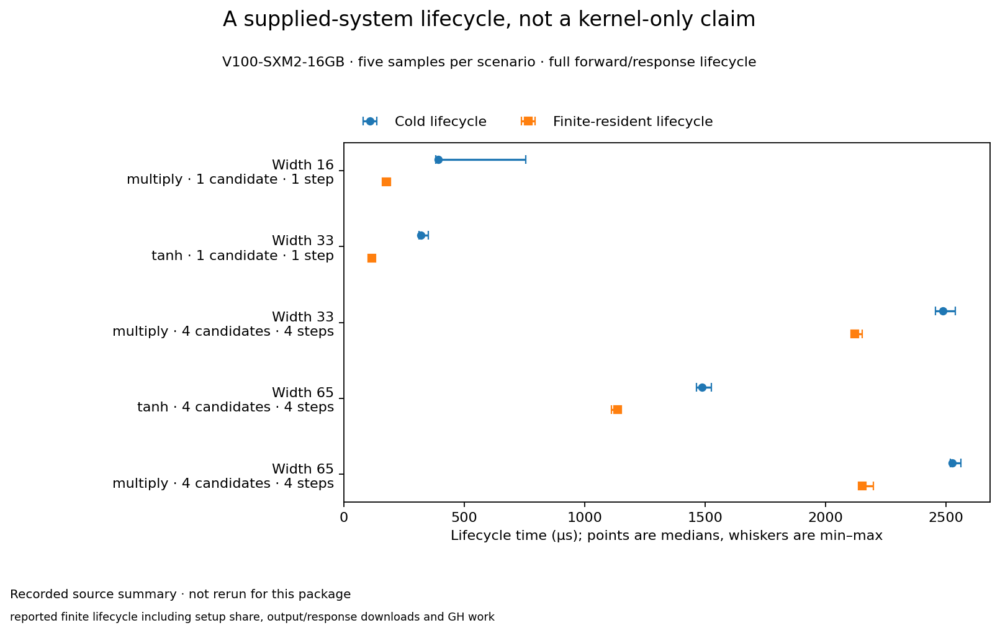

# A supplied-system lifecycle, not a kernel-only claim

**Evidence state:** recorded summary

What does the existing execution → response → observation → inference path actually cost?

Five supplied-system cases completed forward/JVP analytic checks and observation/inference. These lifecycle regimes are not an algorithm-versus-baseline speedup comparison.

| Case | Cold lifecycle (us) | Finite-resident lifecycle (us) |
|---|---:|---:|
| Width 16 · multiply · 1 candidate · 1 step | 391.864 (383.657–755.364) | 176.766 (175.478–193.553) |
| Width 33 · tanh · 1 candidate · 1 step | 319.61 (313.033–350.651) | 115.706 (113.436–126.477) |
| Width 33 · multiply · 4 candidates · 4 steps | 2487.87 (2457.764–2538.335) | 2121.425 (2116.426–2151.994) |
| Width 65 · tanh · 4 candidates · 4 steps | 1487.143 (1463.542–1527.603) | 1136.661 (1110.585–1141.176) |
| Width 65 · multiply · 4 candidates · 4 steps | 2526.272 (2518.457–2561.548) | 2153.613 (2139.353–2198.871) |

## What was measured

**Scope:** reported finite lifecycle including setup share, output/response downloads and GH work. **Statistic:** median. **Uncertainty:** min–max of five raw rows per case/regime; not a confidence interval.

**Hardware:** Tesla V100-SXM2-16GB / sm_70 (reported)

**Cuda:** 12.9 (reported)

**Precision:** Selected direct-map/JVP path; FP16 response not supported by this benchmark

**Warmups:** not recovered; verify before stronger claims

**Repeats:** 5

## Interpretation and limits

- The retained report says five raw measurements per regime, but the referenced CSV and lease receipt are absent from this checkout; the reported raw SHA-256 cannot be verified here.
- The temporary result JSON named by the report is absent. Project Control has no matching CUDA evidence for the report ID.
- The preparation record includes a source-file identity hash whose referent is unspecified; it was not independently authenticated.
- Five raw measurements per regime would be min–max ranges, not confidence intervals; no ranges are published without raw rows.
- One fifth of setup and teardown is assigned to each resident reuse. Full per-use downloads remain, and activity labels describe input-map changes rather than compact active execution.
- Widths, operations and candidate counts differ between rows; these are not competing implementations and support no speedup comparison.

## Reproduce / inspect

Resolve the current benchmark driver and source-specific command from the original record; run under the existing assigned resources only if a refresh is justified.

[Original recorded explanation](../../docs/nf1_adaptive/performance/GH_ACCEPT_COMPLETE_PROGRAM.md) · observed 2026-09-29 at `d523e4e1e775ac435996d8b9d08d3edffc685a00`.

Measurement source: `1c22d320fd65b21976f159792e2e93b2c4af7120` (different from the current document-read revision where stated).

Observed source-file identity: `98cba775ed230170cb7480e5681340991d10dfdf071159e418bcbc6ba48d238b`.

**Before public promotion:** verify/export portable raw evidence; this preparation preview is based on an inspected summary.

[Chart/table input](data/gh-lifecycle.json) · [All selected results](index.md)
