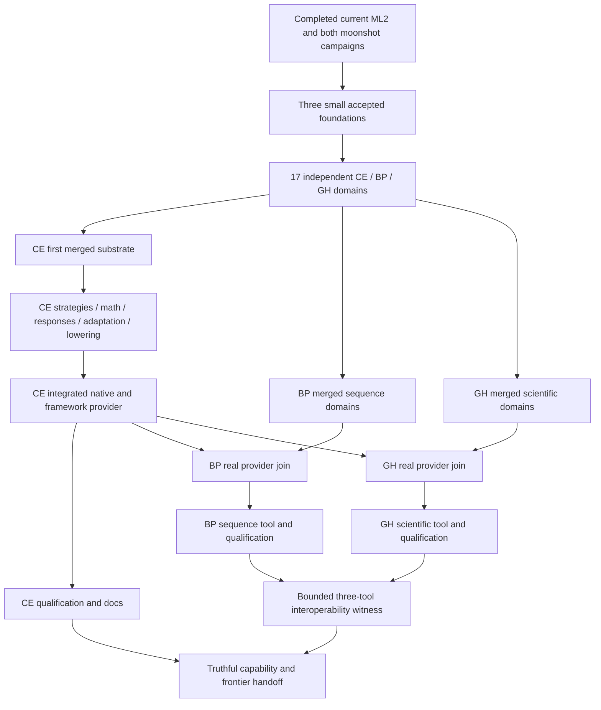

# Task map and accepted-source flow

45 coarse outcomes; three separate closure epics. Dependencies below refer to actual integrated source or the explicitly named merge. Cross-authority provider joins are additional requirements, not local Todo IDs.

## Cellerator

| Outcome | Purpose | Local prerequisites |
|---|---|---|
| [CE-IS1-ADOPT](../tasks/CE-IS1-ADOPT.md) | Reconcile finished predecessors and publish the small shared foundation | Completed predecessors + global review |
| [CE-IS1-STATE](../tasks/CE-IS1-STATE.md) | Unify structured state, support and readout objects | CE-IS1-ADOPT |
| [CE-IS1-PACK](../tasks/CE-IS1-PACK.md) | Publish a format-independent packing strategy seam | CE-IS1-ADOPT |
| [CE-IS1-OPS](../tasks/CE-IS1-OPS.md) | Integrate the current matrix and process mathematics | CE-IS1-ADOPT |
| [CE-IS1-EFFECTS](../tasks/CE-IS1-EFFECTS.md) | Integrate composable effects, residuals and port algebra | CE-IS1-ADOPT |
| [CE-IS1-EXEC](../tasks/CE-IS1-EXEC.md) | Make prepared resident execution the normal path | CE-IS1-ADOPT |
| [CE-IS1-BUILD](../tasks/CE-IS1-BUILD.md) | Make components installable without dependency cycles | CE-IS1-ADOPT |
| [CE-IS1-MERGE-A](../tasks/CE-IS1-MERGE-A.md) | Integrate the first usable mathematical substrate | CE-IS1-STATE, CE-IS1-PACK, CE-IS1-OPS, CE-IS1-EFFECTS, CE-IS1-EXEC, CE-IS1-BUILD |
| [CE-IS1-STRATEGIES](../tasks/CE-IS1-STRATEGIES.md) | Add genuinely different packing and repair strategies | CE-IS1-MERGE-A |
| [CE-IS1-MATH](../tasks/CE-IS1-MATH.md) | Extend the algebra with executable frontier operators | CE-IS1-MERGE-A |
| [CE-IS1-DIFF](../tasks/CE-IS1-DIFF.md) | Compile and integrate requested response computation | CE-IS1-MERGE-A |
| [CE-IS1-ADAPT](../tasks/CE-IS1-ADAPT.md) | Integrate reuse, structural rewrites and trainable regrowth | CE-IS1-MERGE-A |
| [CE-IS1-LOWER](../tasks/CE-IS1-LOWER.md) | Search and integrate useful Volta-native realizations | CE-IS1-MERGE-A |
| [CE-IS1-MERGE-B](../tasks/CE-IS1-MERGE-B.md) | Integrate strategies, responses and frontier math | CE-IS1-STRATEGIES, CE-IS1-MATH, CE-IS1-DIFF, CE-IS1-ADAPT, CE-IS1-LOWER |
| [CE-IS1-TORCH](../tasks/CE-IS1-TORCH.md) | Expose native mathematics through the existing framework adapter | CE-IS1-MERGE-B |
| [CE-IS1-INTEGRATE](../tasks/CE-IS1-INTEGRATE.md) | Publish the installed numerical capability handoff | CE-IS1-TORCH |
| [CE-IS1-QUALIFY](../tasks/CE-IS1-QUALIFY.md) | Measure complete-path performance and extension friction | CE-IS1-INTEGRATE |
| [CE-IS1-DOCS](../tasks/CE-IS1-DOCS.md) | Make the library legible to users and future implementers | CE-IS1-INTEGRATE |
| [CE-IS1-CLOSE](../tasks/CE-IS1-CLOSE.md) | Accept the deliberate, extensible mathematical library | CE-IS1-QUALIFY, CE-IS1-DOCS |

## Baseplane

| Outcome | Purpose | Local prerequisites |
|---|---|---|
| [BP-IS1-ADOPT](../tasks/BP-IS1-ADOPT.md) | Reconcile finished predecessors and publish the small shared foundation | Completed predecessors + global review |
| [BP-IS1-SEQ](../tasks/BP-IS1-SEQ.md) | Integrate exact sequence and source/query contracts | BP-IS1-ADOPT |
| [BP-IS1-HIERARCHY](../tasks/BP-IS1-HIERARCHY.md) | Make effects and refinable hierarchy a usable component | BP-IS1-ADOPT |
| [BP-IS1-INDEX](../tasks/BP-IS1-INDEX.md) | Integrate real rendezvous, subscriptions and factor joins | BP-IS1-ADOPT |
| [BP-IS1-REUSE](../tasks/BP-IS1-REUSE.md) | Integrate edit invalidation and contextual reuse | BP-IS1-ADOPT |
| [BP-IS1-LEARNING](../tasks/BP-IS1-LEARNING.md) | Keep learned representation and routing in the integrated path | BP-IS1-ADOPT |
| [BP-IS1-BUILD](../tasks/BP-IS1-BUILD.md) | Make exact and representation components cleanly installable | BP-IS1-ADOPT |
| [BP-IS1-MERGE-A](../tasks/BP-IS1-MERGE-A.md) | Integrate the sequence-facing domains | BP-IS1-SEQ, BP-IS1-HIERARCHY, BP-IS1-INDEX, BP-IS1-REUSE, BP-IS1-LEARNING, BP-IS1-BUILD |
| [BP-IS1-BRIDGE](../tasks/BP-IS1-BRIDGE.md) | Accept the real Cellerator provider and bind the sequence bridge | BP-IS1-MERGE-A |
| [BP-IS1-COMPOSE](../tasks/BP-IS1-COMPOSE.md) | Deliver an end-to-end adaptive sequence tool | BP-IS1-BRIDGE |
| [BP-IS1-QUALIFY](../tasks/BP-IS1-QUALIFY.md) | Qualify sequence semantics, total cost and meaningful learning scope | BP-IS1-COMPOSE |
| [BP-IS1-DOCS](../tasks/BP-IS1-DOCS.md) | Publish usable sequence APIs and the open research frontier | BP-IS1-COMPOSE |
| [BP-IS1-CLOSE](../tasks/BP-IS1-CLOSE.md) | Accept the integrated, extensible sequence library | BP-IS1-QUALIFY, BP-IS1-DOCS |

## Glasshelix

| Outcome | Purpose | Local prerequisites |
|---|---|---|
| [GH-IS1-ADOPT](../tasks/GH-IS1-ADOPT.md) | Reconcile finished predecessors and publish the small shared foundation | Completed predecessors + global review |
| [GH-IS1-SCIENCE](../tasks/GH-IS1-SCIENCE.md) | Unify scientific specifications and whole-hypothesis results | GH-IS1-ADOPT |
| [GH-IS1-DATA](../tasks/GH-IS1-DATA.md) | Integrate the actual predecessor cohort and experiment adapters | GH-IS1-ADOPT |
| [GH-IS1-MODELS](../tasks/GH-IS1-MODELS.md) | Compose scientific models from Cellerator mathematics | GH-IS1-ADOPT |
| [GH-IS1-ANALYSIS](../tasks/GH-IS1-ANALYSIS.md) | Integrate interrogation and scientific refactoring proposals | GH-IS1-ADOPT |
| [GH-IS1-BUILD](../tasks/GH-IS1-BUILD.md) | Make experiment execution and replay accessible | GH-IS1-ADOPT |
| [GH-IS1-MERGE-A](../tasks/GH-IS1-MERGE-A.md) | Integrate the scientific consumer surface | GH-IS1-SCIENCE, GH-IS1-DATA, GH-IS1-MODELS, GH-IS1-ANALYSIS, GH-IS1-BUILD |
| [GH-IS1-BRIDGE](../tasks/GH-IS1-BRIDGE.md) | Accept installed Cellerator mathematics and framework capabilities | GH-IS1-MERGE-A |
| [GH-IS1-PIPELINE](../tasks/GH-IS1-PIPELINE.md) | Deliver fitted/evaluated models and replayable scientific outputs | GH-IS1-BRIDGE |
| [GH-IS1-QUALIFY](../tasks/GH-IS1-QUALIFY.md) | Evaluate scientific correctness, usability and total execution cost | GH-IS1-PIPELINE |
| [GH-IS1-DOCS](../tasks/GH-IS1-DOCS.md) | Explain the scientific experiment and its usable library path | GH-IS1-PIPELINE |
| [GH-IS1-JOINT](../tasks/GH-IS1-JOINT.md) | Prove the three tools can compose without losing meaning | GH-IS1-PIPELINE |
| [GH-IS1-CLOSE](../tasks/GH-IS1-CLOSE.md) | Accept the scientific tool and the complete successor handoff | GH-IS1-QUALIFY, GH-IS1-DOCS, GH-IS1-JOINT |

## Simplified integration graph

This diagram groups outcomes for readability. The exact machine DAG, source-handoff checks and ideal readiness waves are in the native plans and `tools/validate_package.py` output. Resource budgets and actual task durations determine real concurrency.
